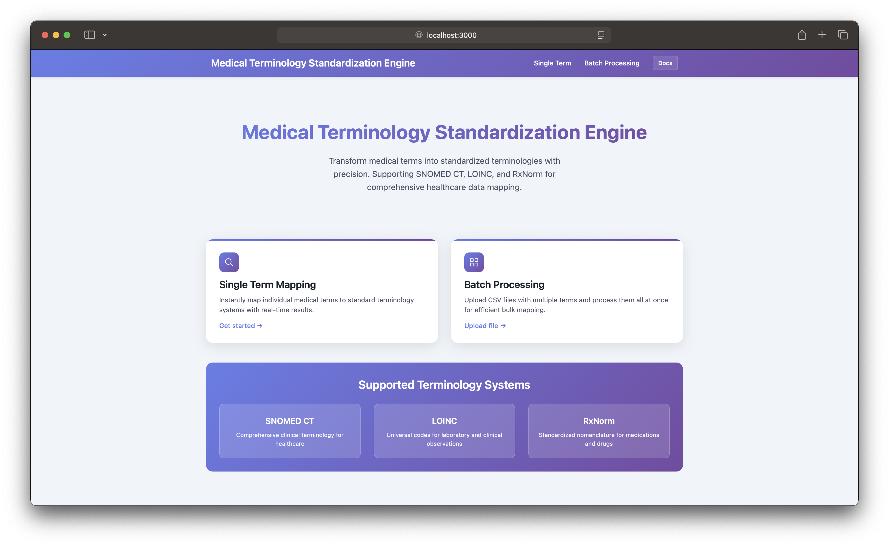
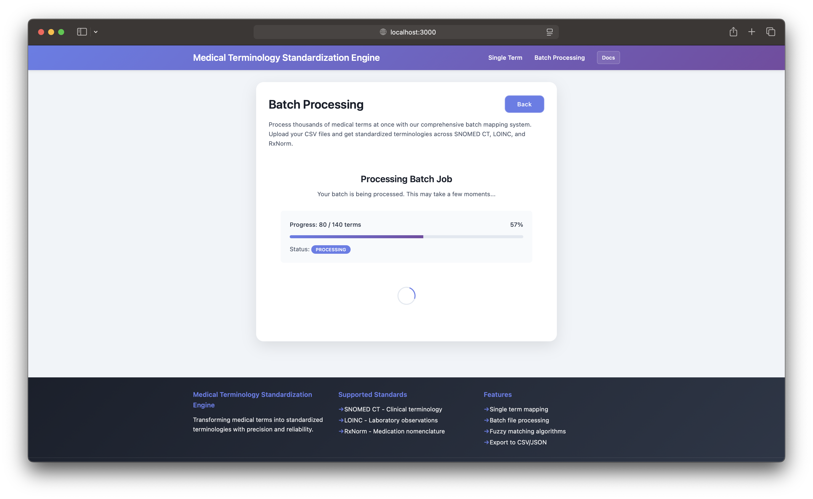
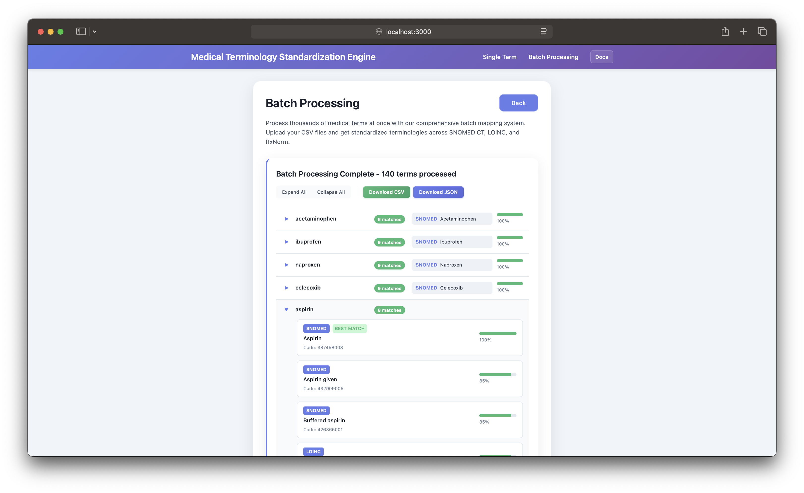
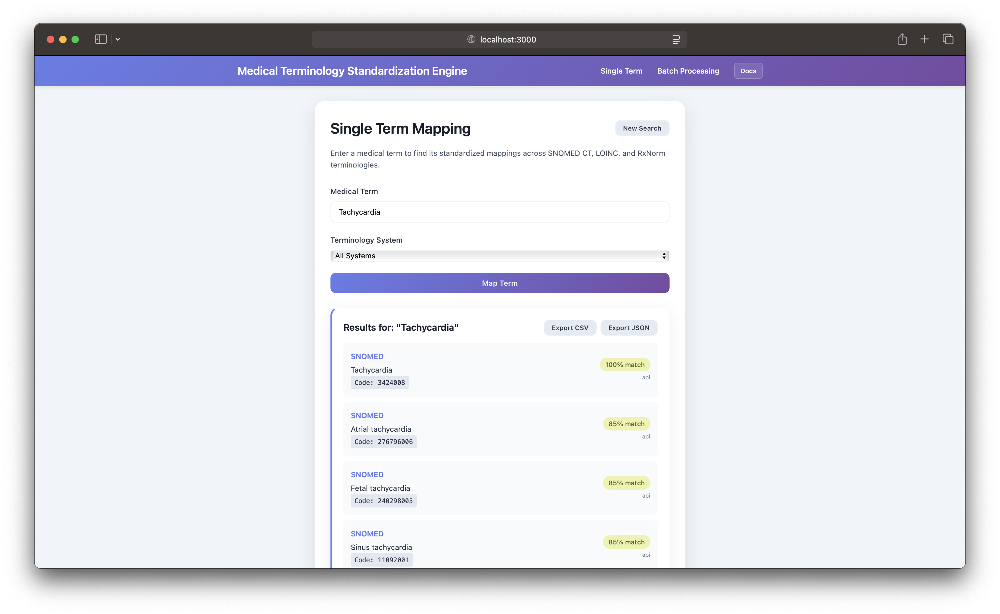

# Medical Terminology Standardization Engine

Maps inconsistent medical terminology (e.g., "heart attack" vs "myocardial infarction" vs "MI") to standard code systems: SNOMED CT, LOINC, and RxNorm.






## How It Works

Terms go through a priority-based pipeline: external APIs first, local database fallback, then fuzzy matching.

**External APIs**
| Source | Terminology | What It Returns |
|--------|-------------|-----------------|
| NIH RxNorm API | RxNorm | Medication names, NDC codes, drug classes |
| Clinical Tables API | LOINC, RxTerms | Lab tests, clinical observations |
| SNOMED Browser | SNOMED CT | Clinical findings, procedures, conditions |

**Local Fallback**: ~1,000 records across three SQLite databases (633 SNOMED, 208 LOINC, 237 RxNorm) for when APIs fail or return nothing.

**Fuzzy Matching**: RapidFuzz algorithms kick in last. There's a length-ratio check (minimum 30% overlap) to prevent false positives from short strings in long terms.

## Confidence Scoring

Results are scored by how well the search term matches the result:

- **Exact match**: 100%
- **Containment** (term within result or vice versa): max(85%, string similarity)
- **Fuzzy match**: best of ratio, token_sort_ratio, token_set_ratio

Anything below 60% gets filtered out. Batch processing caps at 3 results per terminology system (9 total per term)—if the right match exists, it's in the top 3.

## Project Structure

```
├── backend/
│   ├── api/v1/
│   │   ├── routers/          # terminology.py, batch.py
│   │   ├── services/         # terminology_service.py, batch_service.py
│   │   └── models/           # Pydantic schemas
│   ├── app/standards/terminology/
│   │   ├── mapper.py         # Core mapping logic
│   │   ├── fuzzy_matcher.py  # RapidFuzz implementations
│   │   ├── embedded_db.py    # SQLite manager
│   │   └── external_service.py
│   └── data/terminology/     # SQLite databases
│
├── frontend/src/
│   ├── App.tsx
│   ├── services/api.ts
│   └── utils/exportUtils.ts
│
└── docker-compose.yml
```

## Tech Stack

- **Frontend**: React 18, TypeScript, Vite
- **Backend**: FastAPI, Python 3.11
- **Matching**: RapidFuzz
- **Database**: SQLite (local fallback only)
- **Deployment**: Docker Compose

## Setup

```bash
git clone https://github.com/Brandon12200/Medical-Terminology-Standardization-Engine.git
```

```bash
cd Medical-Terminology-Standardization-Engine
```

```bash
./start.sh   # Builds, starts services, and opens browser
```

```bash
./stop.sh    # Stops all services
```

Frontend: http://localhost:3000

API docs: http://localhost:8000/docs

## API

```bash
# Map single term
POST /api/v1/map
{ "term": "diabetes", "systems": ["snomed", "loinc", "rxnorm"] }

# Batch upload (CSV with "term" column)
POST /api/v1/batch/upload

# Poll for status
GET /api/v1/batch/status/{job_id}

# Get results
GET /api/v1/batch/result/{job_id}
```

## Batch Processing

Batch jobs run via FastAPI BackgroundTasks. Upload a file, get a job ID, poll for status, retrieve results. Terms process in batches of 5 with 500ms delays to avoid hammering external APIs.

Job results are stored in memory (Python dict). This means they're lost on server restart, but it keeps the infrastructure simple—users typically process and export in one session anyway.

## Sample Datasets

Six test files with 724+ terms covering different scenarios:

| File | Terms | Focus |
|------|-------|-------|
| hospital_discharge_summary.csv | 120 | Multi-specialty conditions |
| comprehensive_lab_tests.csv | 115 | Hematology, chemistry, microbiology |
| comprehensive_medications.csv | 140 | Drug classes |
| emergency_department_cases.csv | 81 | Triage scenarios |
| surgical_procedures.csv | 117 | Procedures by complexity |
| rare_diseases_comprehensive.csv | 151 | Genetic conditions, syndromes |

## Notes

**Why polling instead of WebSockets?** Batch jobs take 30-120 seconds. Polling every 2 seconds is fine for that timeframe, and way simpler to implement and debug than managing WebSocket connections.

**SQLite**: The local databases are read-only fallbacks with ~1,000 static records. SQLite ships with Python, needs no server process, and lets the whole thing deploy with `docker-compose up`.

**Thread handling**: FastAPI runs in a thread pool. Each thread gets its own mapper instance via `threading.local()` rather than implementing connection pooling. Trades some memory for simplicity.

## License

MIT
